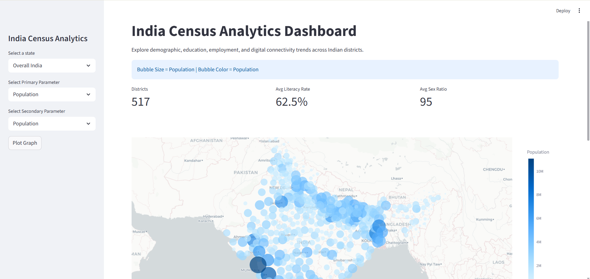

<div align="center">

```
██╗███╗   ██╗██████╗ ██╗ █████╗      ██████╗███████╗███╗   ██╗███████╗██╗   ██╗███████╗
██║████╗  ██║██╔══██╗██║██╔══██╗    ██╔════╝██╔════╝████╗  ██║██╔════╝██║   ██║██╔════╝
██║██╔██╗ ██║██║  ██║██║███████║    ██║     █████╗  ██╔██╗ ██║███████╗██║   ██║███████╗
██║██║╚██╗██║██║  ██║██║██╔══██║    ██║     ██╔══╝  ██║╚██╗██║╚════██║██║   ██║╚════██║
██║██║ ╚████║██████╔╝██║██║  ██║    ╚██████╗███████╗██║ ╚████║███████║╚██████╔╝███████║
╚═╝╚═╝  ╚═══╝╚═════╝ ╚═╝╚═╝  ╚═╝     ╚═════╝╚══════╝╚═╝  ╚═══╝╚══════╝ ╚═════╝ ╚══════╝
```

### 🇮🇳 India Census Analytics Dashboard

> An interactive geospatial dashboard exploring demographic, education, employment, and digital connectivity trends across Indian districts — built with Streamlit, Pandas, and Plotly.

<br/>


</div>

---

## 📌 About

This is my **India Census Analytics Dashboard** — an interactive geospatial data app built using Streamlit, exploring district-level census data across India.

The dashboard lets you filter by state, choose primary and secondary parameters, and visualise them on an interactive bubble map — alongside key summary metrics and a top-10 district leaderboard.

Built to practice:
- Geospatial visualisation with Plotly's scatter mapbox
- Building interactive, parameter-driven Streamlit dashboards
- Working with Indian census data (literacy rate, sex ratio, population, internet access, etc.)

---

## 🎬 Demo

https://github.com/amit-0333/india-census-dashboard/blob/main/dashbboard.mp4

---

## 📸 Screenshot



---

## 📊 Dashboard Features

- 🗺️ State selector — view Overall India or drill into a specific state
- 🔵 Interactive bubble map — bubble **size** and **color** mapped to user-selected parameters
- 📈 KPI cards — Districts count, Avg Literacy Rate, Avg Sex Ratio
- 🏆 Top 10 districts table by selected primary parameter
- 🎛️ 10 selectable metrics: Population, Male, Female, Literate, Households with Internet, Literacy Rate, Sex Ratio, Workers, Households with Computer, Total Power Parity

---

## 🗺️ Project Structure

```
india-census-dashboard/
│
├── 📄 app.py                    # Main Streamlit app
├── 📄 India_Dashboard_.csv      # Census dataset
├── 🎬 dashbboard.mp4            # Dashboard demo video
├── 🖼️ dashoard.png              # Dashboard screenshot
├── 📄 requirements.txt
└── 📄 README.md
```

---

## ⚙️ How to Run

```bash
# 1. Clone the repository
git clone https://github.com/amit-0333/india-census-dashboard.git

# 2. Navigate into the folder
cd india-census-dashboard

# 3. Install dependencies
pip install -r requirements.txt

# 4. Run the app
streamlit run app.py
```

---

## 🛠️ Tech Stack

| Tool | Purpose |
|------|---------|
| 🐍 **Python** | Core language |
| 🎈 **Streamlit** | Dashboard UI and interactivity |
| 🐼 **Pandas** | Data handling |
| 📊 **Plotly** | Interactive bubble maps |

---

## 👨‍💻 Author

**Amit Kumar**

[](https://github.com/amit-0333)
[](https://www.linkedin.com/in/amit-kumar-a62a3640a/)

---

<div align="center">

> 📝 *Built as part of my Data Science and Python learning journey.*

⭐ **Star this repo if you found it useful!**

</div>
